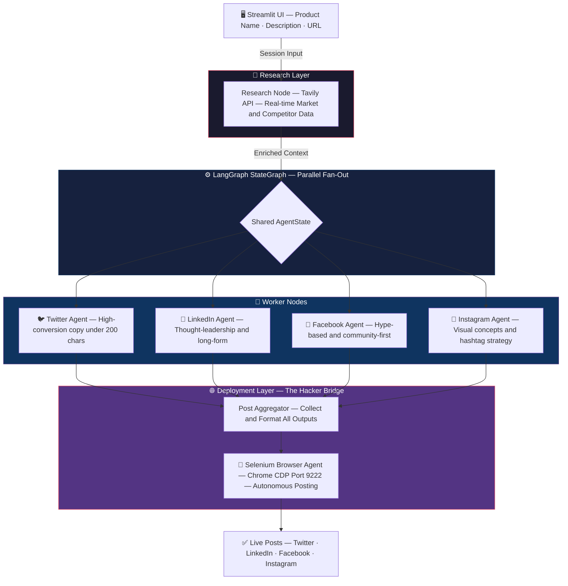

# 🎯 Project Draper
> **An Agentic Social Media Engine for Startups That Refuse to Pay the API Tax.**
> *Research the market. Generate platform-native content. Post autonomously. No API bills.*

[](https://www.python.org/)
[](https://langchain-ai.github.io/langgraph/)
[](https://streamlit.io/)
[](https://openai.com/)
[](LICENSE)

---

## 🚀 Overview

Project Draper is a **Streamlit UI + LangGraph backend** built to eliminate the platform API tax for early-stage startups.

Instead of paying $100+/month for gated APIs before a single user converts, Draper uses a **research-first agentic pipeline** to generate high-quality, platform-native social content — then deploys it autonomously via a Selenium Browser Agent hijacking a local Chrome session.

**One product description in. Four platform-native posts out. Zero API bills.**

**The problem with existing tools:**
- X/Twitter API — $100/mo Basic Tier + business verification
- LinkedIn API — Partnership-gated, weeks of manual review
- Make.com / Zapier — $29–$99/mo proprietary lock-in, impossible to debug
- All of the above — designed for enterprises, not MVPs

---

## ✨ Key Features

- 🧠 **Research-First Pipeline** — Tavily API grounds every post in real market data, zero hallucinations
- ⚡ **Parallel Agent Execution** — All four platform agents run concurrently via LangGraph fan-out
- 🎭 **Platform-Native Voice** — Each agent is independently tuned: punchy for Twitter, authoritative for LinkedIn
- 🔧 **Selenium Browser Agent** — Attaches to your live Chrome session via CDP, no credentials needed
- 🔄 **Modular Node-Swap Design** — Replace Selenium with official APIs in a single line when you scale
- 💸 **Zero Platform Fees** — Bootstrapped MVP to production without changing your architecture

---

## 🏗️ Architecture



---

## 🛠️ Tech Stack

### Frontend
* **Streamlit** — Operator-facing UI for product input
* **Python** — Core runtime

### Backend
* **LangGraph** `StateGraph` — Parallel agentic orchestration
* **OpenAI GPT-4o / Gemini 1.5 Pro** — Platform-tuned content generation
* **Tavily Search API** — Real-time market & competitor research

### Deployment
* **Selenium 4** + **ChromeDriver** — Autonomous Chrome CDP posting
* **`pip` / `venv`** — Dependency management

---

## ⚡ Installation (Local Development)

### 1️⃣ Clone the Repository
```bash
git clone https://github.com/your-org/project-draper.git
cd project-draper
```

### 2️⃣ Backend Setup
```bash
# Create and activate virtual environment
python -m venv .venv
source .venv/bin/activate      # Windows: .venv\Scripts\activate

# Install dependencies
pip install -r requirements.txt
```

**Create a `.env` file in the project root:**
```ini
# LLM Provider — choose one
OPENAI_API_KEY=sk-...
GOOGLE_API_KEY=AIza...

# Research Layer
TAVILY_API_KEY=tvly-...

# Model Config
LLM_PROVIDER=openai        # or "google"
LLM_MODEL=gpt-4o           # or "gemini-1.5-pro"

# Chrome CDP
CHROME_DEBUGGER_PORT=9222
CHROME_PROFILE_PATH=/path/to/your/chrome/profile
```

### 3️⃣ Chrome Debugging Mode (Critical)

Draper's Browser Agent **attaches to an existing Chrome session** via CDP — not a new one. Your saved logins and cookies are used directly. No OAuth, no credential rotation.

**Step 1 — Pre-login to all platforms in Chrome normally (Twitter/X, LinkedIn, Facebook, Instagram)**

**Step 2 — Fully close Chrome** (check system tray, force-quit if needed)

**Step 3 — Relaunch Chrome with remote debugging:**

```bash
# macOS
/Applications/Google\ Chrome.app/Contents/MacOS/Google\ Chrome \
  --remote-debugging-port=9222 \
  --user-data-dir="/Users/$(whoami)/Library/Application Support/Google/Chrome"

# Linux
google-chrome --remote-debugging-port=9222 --user-data-dir="$HOME/.config/google-chrome"

# Windows (PowerShell)
& "C:\Program Files\Google\Chrome\Application\chrome.exe" `
  --remote-debugging-port=9222 `
  --user-data-dir="$env:LOCALAPPDATA\Google\Chrome\User Data"
```

**Step 4 — Verify the connection:**
```bash
curl http://localhost:9222/json/version
```
A JSON response with Chrome version metadata means you're good to go.

> ⚠️ **Security Note:** Never expose port 9222 beyond localhost. This grants full access to your browser session.

### 4️⃣ Run the Application
```bash
streamlit run app.py
```
Navigate to `http://localhost:8501`. Enter your product name, description, and URL — then let Draper run.

---

## 🗂️ Project Structure

```
project-draper/
├── app.py                        # Streamlit entry point
├── graph/
│   ├── state.py                  # AgentState TypedDict
│   ├── graph_builder.py          # LangGraph StateGraph + compilation
│   └── nodes/
│       ├── research_node.py      # Tavily research + context synthesis
│       ├── twitter_agent.py      # < 200 char high-conversion copy
│       ├── linkedin_agent.py     # Thought-leadership long-form
│       ├── facebook_agent.py     # Community-hype copy
│       └── instagram_agent.py    # Visual concepts + hashtag strategy
├── browser/
│   ├── chrome_driver.py          # CDP session attachment
│   └── poster.py                 # Platform-specific posting logic
├── config/
│   └── settings.py               # API keys, model config, targets
├── requirements.txt
├── .env.example
└── README.md
```

---

## 🧩 Engineering Challenges Solved

### 💸 The API Tax Problem
**Problem:** Every major platform gates programmatic access behind $100+/mo fees and enterprise verification — before you have a single paying user.
**Solution:** Selenium Browser Agent attaches to a live, authenticated Chrome session via CDP. Your existing logins become the credential layer. No API contracts, no business verification, no monthly fees.

### ⚙️ Parallel Content Generation
**Problem:** Sequential LLM calls across four platforms creates unacceptable latency for a real-time workflow.
**Solution:** LangGraph `StateGraph` fans out to all four worker agents simultaneously via `asyncio`. A four-platform run takes the same time as a single-platform run.

### 🔄 The Scale-Without-Rewrite Problem
**Problem:** Selenium-based posting is perfect for MVPs but not for production at scale. Most tools force a full rewrite when you outgrow them.
**Solution:** Every layer is a discrete, swappable LangGraph node. When official API economics make sense, it's a single import swap in `graph_builder.py` — the research, orchestration, and all content agents stay untouched.

```python
# MVP — zero cost via Selenium
from browser.poster import SeleniumPoster as DeploymentNode

# Production — swap when you're ready
# from integrations.twitter_api import TwitterAPIClient as DeploymentNode

graph.add_node("deploy", DeploymentNode.run)
```

---

## 🔮 Future Roadmap

- [ ] Add **human-in-the-loop approval gate** before Browser Agent posts
- [ ] Add **scheduled posting queue** with cron-based triggers
- [ ] Add **engagement analytics ingestion node** to close the feedback loop
- [ ] Add **official API adapter nodes** (Twitter, LinkedIn) for production scale
- [ ] Add **multi-brand support** with isolated state contexts per product

---

## 🤝 Contributing

PRs and Issues are welcome!
For significant architectural changes, open an Issue first to align on direction.
If this project helps you ship faster, consider starring ⭐ the repo.

## 👤 Built by

**Harshit Negi**
